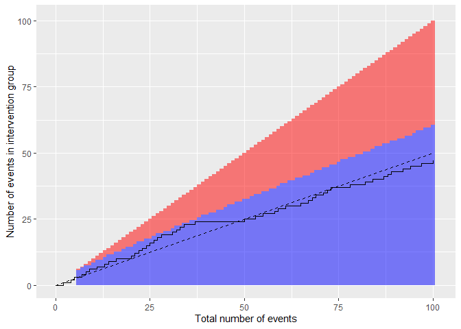
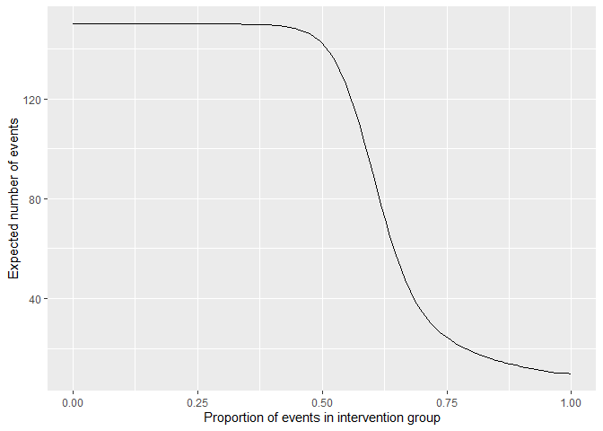
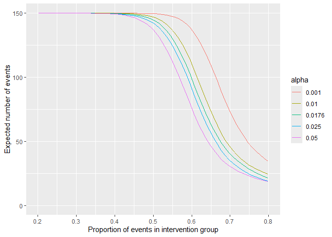
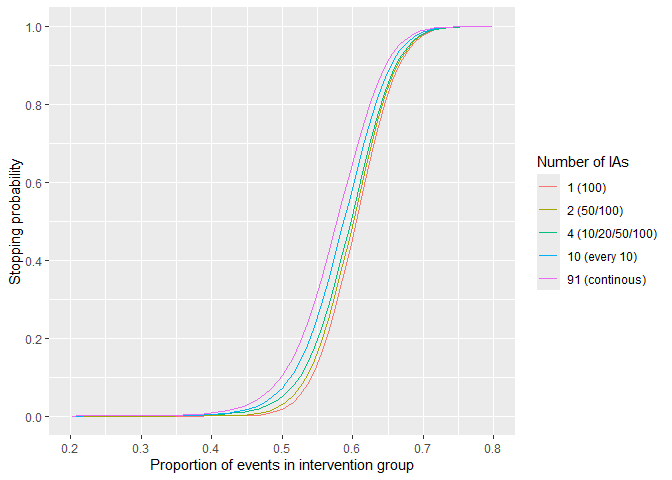

<!-- README.md is generated from README.Rmd. Please edit that file -->

# harmBounds

<!-- badges: start -->

[](https://github.com/CTU-Bern/harmBounds/actions)
<!-- badges: end -->

The harmBounds package calculates stopping probabilities, defines
stopping boundaries and generates plots for safety monitoring using an
event based approach.

The idea is that under the null hypothesis of no safety concern, safety
events are expected to occur at a frequency proportional to the
randomization ratio. We can therefore do one sample binomial exact tests
on the proportion of events in the intervention arm. Evidence that this
proportion higher than what would be expected from randomization would
indicate a safety problem.

The safety monitoring can be done continuously after every event or at a
pre-specified total number of events. The nominal test-wise alpha would
be calibrated to obtain desired properties, such as a certain proportion
of stopping under alternative scenarios of some degree of safety
problems (the power). An overall Type I error control can also be
implemented but we would usually not recommend that for safety testing,
as the consequence of a Type II error (not stopping for safety if the
intervention is not safe) is arguably worse than of a Type I error
(stopping if the intervention is safe).

The procedure is computationally efficient and fully reproducible, as
all calculations are exact and derived in closed form from the binomial
distribution. And it is not limited to a single event per participant or
to a specific type of event.

## Installation

The package can be installed from [GitHub](https://github.com/) with:

``` r
# install.packages("devtools")
devtools::install_github("CTU-Bern/harmBounds")
```

## Calculation of boundaries

Stopping boundaries can be calculated with function *getHarmBound*.
Let’s assume a trial with 10 safety interim analyses after every 10
events (combined over both groups) up to a total of 100 events and a
nominal test-wise alpha of 0.025.

``` r
hb<-getHarmBound(nevents = seq(10, 100, by = 10), alpha_test = 0.025, pH0 = 0.5)
hb
#> $bounds
#>    events events_intervention events_control alpha_test
#> 1      10                   9              1      0.025
#> 2      20                  15              5      0.025
#> 3      30                  21              9      0.025
#> 4      40                  27             13      0.025
#> 5      50                  33             17      0.025
#> 6      60                  39             21      0.025
#> 7      70                  44             26      0.025
#> 8      80                  50             30      0.025
#> 9      90                  55             35      0.025
#> 10    100                  61             39      0.025
#> 
#> $stopprob
#> $stopprob$`0.5`
#>    events  pH hyp   stop_prob cum_stop_prob
#> 1      10 0.5  H0 0.010742188    0.01074219
#> 2      20 0.5  H0 0.016405106    0.02714729
#> 3      30 0.5  H0 0.011266726    0.03841402
#> 4      40 0.5  H0 0.007307253    0.04572127
#> 5      50 0.5  H0 0.004798221    0.05051949
#> 6      60 0.5  H0 0.003217823    0.05373732
#> 7      70 0.5  H0 0.006730864    0.06046818
#> 8      80 0.5  H0 0.003002399    0.06347058
#> 9      90 0.5  H0 0.005713749    0.06918433
#> 10    100 0.5  H0 0.002449994    0.07163432
#> 
#> 
#> $opchar
#>     p cum_stop_prob expected_events hyp
#> 1 0.5    0.07163432        95.80595  H0
#> 
#> attr(,"class")
#> [1] "harmbound" "list"
```

The data frame *bounds* specifies the boundaries at each interim
analysis, *events_intervention* is the minimal number of events in the
intervention group that would lead to a stopping of the trial. The list
*stopprob* contains stopping probability at each analysis for the null
and optionally alternative hypotheses (see below). Data frame *opchar*
shows the cumulative stopping probability and the expected number of
events for each hypothesis.

In the example above, the overall Type I error of the safety testing is
7.2%. If we stop at 100 total events (by default, even if the boundary
is not breached), the expected number of events is 96.

Typically, the trial might not be stopped at the last interim analysis,
which can be specified using the *maxevents* option:

``` r
hb<-getHarmBound(nevents = seq(10, 100, by = 10), alpha_test = 0.025, pH0 = 0.5, maxevents = 150)
hb$opchar
#>     p cum_stop_prob expected_events hyp
#> 1 0.5    0.07163432        142.2242  H0
```

If we would like to control the Type I error at a specific level (which
we do not necessarily recommend, see above), the test-wise alpha can be
obtained using function *getAlphaPerTest*.

``` r
alphaPerTest<-getAlphaPerTest(nevents = seq(10, 100, by = 10), pH0 = 0.5, totalAlpha = 0.05)

alphaPerTest
#> [1] 0.01760014

hb<-getHarmBound(nevents = seq(10, 100, by = 10), alpha_test = alphaPerTest, pH0 = 0.5, maxevents = 150)

hb$opchar
#>     p cum_stop_prob expected_events hyp
#> 1 0.5    0.05104241        144.7846  H0
```

The overall Type I error is 5.1%, i.e. as close to 5% as possible (given
the discrete nature of the test). Note that with this example that is
slightly higher than 5%. If a strict control at 5% would required a
*totalAlpha* of 0.049 would have to be chosen.

## Plotting of boundaries

The boundaries can be plotted using *harmboundPlot* (or the
harmbound.plot-method):

``` r
hb<-getHarmBound(nevents = seq(10, 100, by = 10), alpha_test = 0.025, pH0 = 0.5, maxevents = 150)
plot(hb)
```


Where the bars indicate the time points of the interim analysis with the
rejection region in red, and the dashed line represents the expectation
(can be removed with ‘H0line = FALSE’)

Continuous monitoring could also be implemented:

``` r
hb<-getHarmBound(nevents = 0:100, alpha_test = 0.025, pH0 = 0.5, maxevents = 150)
plot(hb) 
```


Observed data can be added as vector with 0 and 1, indicated the
sequence of the groups in which events occurred (0 being the control and
1 the intervention group).

``` r
set.seed(123)
eventgroups<-rbinom(n = 100, size = 1, prob = 0.5)
plot(hb,observed=eventgroups) 
```

 The
boundary is not breached at any of the 10 interim analysis.

Or with continuous monitoring:

``` r
hb<-getHarmBound(nevents = 0:100, alpha_test = 0.025, pH0 = 0.5, maxevents = 150)
set.seed(123)
eventgroups<-rbinom(n = 100, size = 1, prob = 0.5)
plot(hb, observed = eventgroups) 
```



## Operating characteristics

Stopping probabilities and expected number of events can be obtained for
alternative scenarios with the *getHarmBound* function. The alternative
hypothesis can be specified as

- pH1: the proportion of the events in the intervention group, with 0.5
  being the null scenario for a 1:1 rando, and numbers from 0.5 to 1
  indicating a safety problem.

- rrH1: the risk ratio (intervention / control), with 1 being the null
  scenario and numbers \>1 indicating a safety problem.

- rdH1: the risk difference (intervention minus control), with 0 being
  the null scenario and numbers \>0 indicating a safety problem. Here
  the control proportion (r0) and the total number of participants (n)
  have to be specified.

- orH1: the odds ratio (intervention / control), with 1 being the null
  scenario and number \>1 indicating a safety problem. Here the control
  proportion (r0) has to be specified.

To stay in the event-based setting, we recommend using the first two
options (pH1 or rrH1).

``` r
#with proportion of events in the intervention group:
hb<-getHarmBound(nevents = seq(10, 100, by = 10), alpha_test = 0.025, pH0 = 0.5, pH1 = 0.6, maxevents = 150)
hb
#> $bounds
#>    events events_intervention events_control alpha_test
#> 1      10                   9              1      0.025
#> 2      20                  15              5      0.025
#> 3      30                  21              9      0.025
#> 4      40                  27             13      0.025
#> 5      50                  33             17      0.025
#> 6      60                  39             21      0.025
#> 7      70                  44             26      0.025
#> 8      80                  50             30      0.025
#> 9      90                  55             35      0.025
#> 10    100                  61             39      0.025
#> 
#> $stopprob
#> $stopprob$`0.5`
#>    events  pH hyp   stop_prob cum_stop_prob
#> 1      10 0.5  H0 0.010742188    0.01074219
#> 2      20 0.5  H0 0.016405106    0.02714729
#> 3      30 0.5  H0 0.011266726    0.03841402
#> 4      40 0.5  H0 0.007307253    0.04572127
#> 5      50 0.5  H0 0.004798221    0.05051949
#> 6      60 0.5  H0 0.003217823    0.05373732
#> 7      70 0.5  H0 0.006730864    0.06046818
#> 8      80 0.5  H0 0.003002399    0.06347058
#> 9      90 0.5  H0 0.005713749    0.06918433
#> 10    100 0.5  H0 0.002449994    0.07163432
#> 
#> $stopprob$`0.6`
#>    events  pH hyp  stop_prob cum_stop_prob
#> 1      10 0.6  H1 0.04635740     0.0463574
#> 2      20 0.6  H1 0.09503665     0.1413940
#> 3      30 0.6  H1 0.08037764     0.2217717
#> 4      40 0.6  H1 0.06377080     0.2855425
#> 5      50 0.6  H1 0.05117939     0.3367219
#> 6      60 0.6  H1 0.04194665     0.3786685
#> 7      70 0.6  H1 0.07679694     0.4554655
#> 8      80 0.6  H1 0.03922701     0.4946925
#> 9      90 0.6  H1 0.06524712     0.5599396
#> 10    100 0.6  H1 0.03194760     0.5918872
#> 
#> 
#> $opchar
#>     p cum_stop_prob expected_events hyp
#> 1 0.5    0.07163432        142.2242  H0
#> 2 0.6    0.59188721         91.2001  H1
#> 
#> attr(,"class")
#> [1] "harmbound" "list"
```

Note that *stopprob* is now of length two with a data frame for each
condition.

We would stop in 7.2% of the trials under the null (no safety problem)
and in 59.2% under the alternative (safety problem with 60% of the
events in the intervention group). Because of the higher probability of
early stopping, the expected number of events is reduced from 142 under
H0 to 91 under H1.

The (cumulative) stopping probabilities at each step can be plotted
using *absstopPlot* or *cumstopPlot* (or the harmbound.plot-methods). We
now using more than one alternative to make it more interesting:

``` r
hb<-getHarmBound(nevents = seq(10, 100, by = 10), alpha_test = 0.025, 
  pH0 = 0.5, pH1 = c(0.6, 0.7, 0.8) , maxevents = 150)
plot(hb, which = "abs_stopping")
```


``` r
plot(hb, which = "cum_stopping")
```


We can also specify a vector of alternatives and plot the cumulative
stopping probabilities or the expected number of events for each
alternative.

``` r
hb<-getHarmBound(nevents = seq(10, 100, by = 10), alpha_test = 0.025, pH0 = 0.5, 
  pH1 = seq(0,1,l=100), maxevents = 150)
plot(hb, which = "opchar_stop")
```


``` r
plot(hb, which = "opchar_n")
```



## Choosing the test-wise alpha

To choose the test-wise alpha, we recommend to control the power rather
than the Type I error. I.e. to check that a sufficient proportion of
trials are stopped under an appropriate alternative hypothesis
(reflecting a safety problem).

To do that we would check the stopping probabilities for a grid of
alphas:

``` r
alphaPerTest <- getAlphaPerTest(nevents = seq(10, 100, by = 10), pH0 = 0.5,
  totalAlpha = 0.05)
alist<-c(0.001,0.01,alphaPerTest,0.025,0.05)

hbl<-lapply(alist,function(x)
  getHarmBound(nevents = seq(10, 100, by = 10), alpha_test = x,
  pH0 = 0.5, pH1 = seq(0,1,l=100), maxevents = 150)$opchar)

hbd<-data.frame(do.call(rbind,hbl),alpha=rep(alist,each=nrow(hbl[[1]])))
hbd$alpha<-as.factor(round(hbd$alpha,4))

hbd %>% 
    ggplot(aes(x = p, y = cum_stop_prob, colour=alpha)) + 
    geom_line() +
    ylab("Stopping probability") +
    xlab("Proportion of events in intervention group") +
    scale_x_continuous(breaks=seq(0,1,by=0.1),limits=c(0.2,0.8)) +
    scale_y_continuous(breaks=seq(0,1,by=0.2))
```


``` r

hbd %>% 
    ggplot(aes(x = p, y = expected_events, colour=alpha)) + 
    geom_line() +
    ylab("Expected number of events") +
    xlab("Proportion of events in intervention group") +
    scale_x_continuous(breaks=seq(0,1,by=0.1),limits=c(0.2,0.8)) +
    scale_y_continuous(limits=c(0, 150))
```



or on the transformed risk ratio scale:

``` r
alphaPerTest <- getAlphaPerTest(nevents = seq(10, 100, by = 10), pH0 = 0.5,
  totalAlpha = 0.05)
alist<-c(0.001,0.01,alphaPerTest,0.025,0.05)

hbl<-lapply(alist,function(x)
  getHarmBound(nevents = seq(10, 100, by = 10), alpha_test = x, pH0 = 0.5,
  rrH1 = seq(0,10,l=100), maxevents = 150)$opchar)

hbd<-data.frame(do.call(rbind,hbl),alpha=rep(alist,each=nrow(hbl[[1]])))
hbd$alpha<-as.factor(round(hbd$alpha,4))
hbd$lrr<-log(hbd$rr)

hbd %>% 
    ggplot(aes(x = rr, y = cum_stop_prob, colour=alpha)) + 
    geom_line() +
    ylab("Stopping probability") +
    xlab("Risk ratio (intervention/control)") +
    scale_x_continuous(trans='log', breaks=c(0.5,0.75,1,1.5,2,3,4),
      minor_breaks=NULL,limits=c(0.5,5)) +
    scale_y_continuous(breaks=seq(0,1,by=0.2))
```


The step-wise alpha that leads to a reasonable stopping probability
under an appropriate alternative can be selected. However, the steepness
of the curve is not influenced by the alpha. We can only choose between
making more Type I or II errors but not reduce the overall error rate.

We could e.g. specify that at least 70% of the trials should be stopped
if the risk of having a safety event increase by half (i.e. a risk ratio
of 1.5), i.e. a test-wise alpha of close to 0.05. However, this would
also lead to a stopping of 12.5% of the trials under the null.

On the other hand, if we control the Type I error at 5% using a
test-wise alpha of 0.0176, only 55% of the trials are stopped if there
is a safety problem with a risk ratio of 1.5.

## Further paramaters

The number of interim analyses has some impact on steepness and location
of the curve, but it is rather limited, as long as the last interim
analysis is at the same time point.

``` r
nelist<-list(c(100),c(50,100),c(10,20,50,100),
             seq(10, 100, by = 10),seq(10, 100, by = 1))

hbl<-lapply(nelist,function(x)
  getHarmBound(nevents = x, alpha_test = 0.025, pH0 = 0.5,
    pH1 = seq(0,1,l=100), maxevents = 150)$opchar)

nis<-unlist(lapply(nelist,length))
net<-unlist(lapply(nelist,function(x) paste(x,collapse = "/")))
net[[length(net)-1]]<-"every 10"
net[[length(net)]]<-"continous"
nism<-paste0(nis," (",net,")")
hbd<-data.frame(do.call(rbind,hbl),ni=rep(nism,each=nrow(hbl[[1]])))
hbd$ni<-factor(hbd$ni,levels=nism)

hbd %>% 
    ggplot(aes(x = p, y = cum_stop_prob, colour=ni)) + 
    geom_line() +
    ylab("Stopping probability") +
    xlab("Proportion of events in intervention group") +
    scale_x_continuous(breaks=seq(0,1,by=0.1),limits=c(0.2,0.8)) +
    scale_y_continuous(breaks=seq(0,1,by=0.2)) +
    labs(colour="Number of IAs")
```



To substantially decrease the total error rates (i.e. get steeper
curves), we would need a higher total number of events:

``` r

nelist<-list(seq(10, 20, by = 10),seq(10, 50, by = 10), seq(10, 100, by = 10), seq(10, 200, by = 10))

hbl<-lapply(nelist,function(x)
  getHarmBound(nevents = x, alpha_test = 0.025, pH0 = 0.5,
  pH1 = seq(0,1,l=100))$opchar)

nis<-unlist(lapply(nelist,max))
hbd<-data.frame(do.call(rbind,hbl),ni=rep(nis,each=nrow(hbl[[1]])))
hbd$ni<-as.factor(hbd$ni)

hbd %>% 
    ggplot(aes(x = p, y = cum_stop_prob, colour=ni)) + 
    geom_line() +
    ylab("Stopping probability") +
     xlab("Proportion of events in intervention group") +
    scale_x_continuous(breaks=seq(0,1,by=0.1),limits=c(0.2,0.8)) +
    scale_y_continuous(breaks=seq(0,1,by=0.2)) +
    labs(colour="Total number of events")
```


