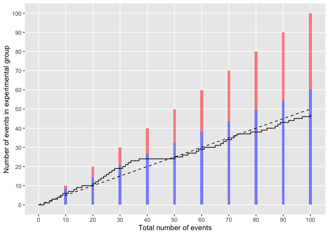

<!-- README.md is generated from README.Rmd. Please edit that file -->

# harmBounds

<!-- badges: start -->

[](https://github.com/CTU-Bern/harmBounds/actions)
<!-- badges: end -->

The harmBounds package calculates stopping probabilities, defines
stopping boundaries and generates plots for safety monitoring using an
event based approach.

The idea is to do simple one sample binomial exact tests on the
proportion of events in the experimental arm. A safety problem is
claimed if there is evidence that this proportion higher than what would
be expected from the number of people under observation in the two arms
(e.g. 0.5 in a 1:1 randomized trial).

The safety monitoring can be done continuously after every event or at a
pre-specified total number of events. The nominal test-wise alpha would
be calibrated to obtain desired properties, such as a certain proportion
of stopping under alternative scenarios of some degree of safety
problems (the power). An overall type I error control can also be
implemented but we would usually not recommend that for safety testing,
as the consequence of a type II error (not stopping for safety if the
intervention is not safe) is arguably worse than of a type I error
(stopping if the intervention is safe).

## Installation

The package can be installed from [GitHub](https://github.com/) with:

``` r
# install.packages("devtools")
devtools::install_github("CTU-Bern/harmBounds",)
```

## Calculation of boundaries

Stopping boundaries can be calculated with function *getHarmBound*.
Let’s assume a trial with 10 safety interim analyses after every 10
events (combined over both groups) up to a total of 100 events and a
nominal test-wise alpha of 0.025.

``` r
hb<-getHarmBound(nevents = seq(10, 100, by = 10), alpha_test = 0.025, pH0 = 0.5)
hb
#> $bounds
#>    events events_exp events_control       rr alpha_test pH0 stop_prob_H0
#> 1      10          9              1 9.000000      0.025 0.5  0.010742188
#> 2      20         15              5 3.000000      0.025 0.5  0.016405106
#> 3      30         21              9 2.333333      0.025 0.5  0.011266726
#> 4      40         27             13 2.076923      0.025 0.5  0.007307253
#> 5      50         33             17 1.941176      0.025 0.5  0.004798221
#> 6      60         39             21 1.857143      0.025 0.5  0.003217823
#> 7      70         44             26 1.692308      0.025 0.5  0.006730864
#> 8      80         50             30 1.666667      0.025 0.5  0.003002399
#> 9      90         55             35 1.571429      0.025 0.5  0.005713749
#> 10    100         61             39 1.564103      0.025 0.5  0.002449994
#>    cum_stop_prob_H0
#> 1        0.01074219
#> 2        0.02714729
#> 3        0.03841402
#> 4        0.04572127
#> 5        0.05051949
#> 6        0.05373732
#> 7        0.06046818
#> 8        0.06347058
#> 9        0.06918433
#> 10       0.07163432
#> 
#> $cum_stop_prob
#>     p cum_stop_prob hyp
#> 1 0.5    0.07163432  H0
#> 
#> attr(,"class")
#> [1] "harmbound" "list"
```

The data frame *bounds* specifies the boundaries at each interim
analysis, *events_exp* is the minimal number of events in the
experimental group that would lead to a stopping of the trial, *rr* the
corresponding risk ratio and *cum_stop_prob_H0* the cumulative stopping
probability under the null hypothesis of no difference between the
groups. The overall type I error of the safety testing is 7.2%.

If we would like to control the type I error at a specific level (which
we do not necessarily recommend, see above), the test-wise alpha can be
obtained using function *getAlphaPerTest*.

``` r
alphaPerTest<-getAlphaPerTest(nevents = seq(10, 100, by = 10), pH0 = 0.5, totalAlpha = 0.05)

alphaPerTest
#> [1] 0.01760014

hb<-getHarmBound(nevents = seq(10, 100, by = 10), alpha_test = alphaPerTest, pH0 = 0.5)
hb 
#> $bounds
#>    events events_exp events_control       rr alpha_test pH0 stop_prob_H0
#> 1      10          9              1 9.000000 0.01760014 0.5  0.010742188
#> 2      20         16              4 4.000000 0.01760014 0.5  0.003862381
#> 3      30         22              8 2.750000 0.01760014 0.5  0.004922465
#> 4      40         28             12 2.333333 0.01760014 0.5  0.003896854
#> 5      50         33             17 1.941176 0.01760014 0.5  0.008795958
#> 6      60         39             21 1.857143 0.01760014 0.5  0.004049838
#> 7      70         45             25 1.800000 0.01760014 0.5  0.002581452
#> 8      80         50             30 1.666667 0.01760014 0.5  0.005311134
#> 9      90         56             34 1.647059 0.01760014 0.5  0.002363631
#> 10    100         61             39 1.564103 0.01760014 0.5  0.004516510
#>    cum_stop_prob_H0
#> 1        0.01074219
#> 2        0.01460457
#> 3        0.01952703
#> 4        0.02342389
#> 5        0.03221985
#> 6        0.03626968
#> 7        0.03885114
#> 8        0.04416227
#> 9        0.04652590
#> 10       0.05104241
#> 
#> $cum_stop_prob
#>     p cum_stop_prob hyp
#> 1 0.5    0.05104241  H0
#> 
#> attr(,"class")
#> [1] "harmbound" "list"
```

The overall type I error is 5.1%, i.e. as close to 5% as possible (given
the discrete nature of the test). Note that with this example that is
slightly higher than 5%. If a strict control at 5% would required a
*totalAlpha* of 0.049 would have to be chosen.

## Plotting of boundaries

The boundaries can be plotted using *harmboundPlot* (or the
harmbound.plot-method):

``` r
hb<-getHarmBound(nevents = seq(10, 100, by = 10), alpha_test = 0.025, pH0 = 0.5)

plot(hb) + 
  scale_x_continuous(breaks = seq(0, 100, by = 10), minor_breaks = NULL) +
  scale_y_continuous(breaks = seq(0, 100, by = 10), minor_breaks = NULL) 
```


Where the bars indicate the time points of the interim analysis with the
rejection region in red, and the dashed line represents the expectation
(can be removed with ‘H0line = FALSE’)

Continuous monitoring could also be implemented:

``` r
hb<-getHarmBound(nevents = 0:100, alpha_test = 0.025, pH0 = 0.5)

plot(hb) + 
  scale_x_continuous(breaks = seq(0, 100, by = 10), minor_breaks = NULL) +
  scale_y_continuous(breaks = seq(0, 100, by = 10), minor_breaks = NULL) 
```


Observed data can be added as vector with 0 and 1, indicated the
sequence of the groups in which events occured (0 being the control and
1 the experimental group).

``` r
hb<-getHarmBound(nevents = seq(10, 100, by = 10), alpha_test = 0.025, pH0 = 0.5)

set.seed(123)
eventgroups<-rbinom(n = 100, size = 1, prob = 0.5)

plot(hb,observed=eventgroups) + 
  scale_x_continuous(breaks = seq(0, 100, by = 10), minor_breaks = NULL) +
  scale_y_continuous(breaks = seq(0, 100, by = 10), minor_breaks = NULL) 
```

 The
boundary is not breached at any of the 10 interim analysis.

Or with continuous monitoring:

``` r
set.seed(123)

hb<-getHarmBound(nevents = 0:100, alpha_test = 0.025, pH0 = 0.5)

eventgroups<-rbinom(n = 100, size = 1, prob = 0.5)

plot(hb, observed = eventgroups) + 
  scale_x_continuous(breaks = seq(0, 100, by = 10), minor_breaks = NULL) +
  scale_y_continuous(breaks = seq(0, 100, by = 10), minor_breaks = NULL) 
```


## Determine test-wise alpha

To set the test-wise alpha, we recommend to control the power rather
than the type I error. I.e. to check that a sufficient proportion of
trials are stopped under an appropriate alternative hypothesis
(reflecting a safety problem).

Stopping probabilities for alternatives can also be obtained with the
*getHarmBound* function. The alternative hypothesis can be specified as

- pH1: the proportion of the events in the experimental group, with 0.5
  being the null scenario for a 1:1 rando, and numbers from 0.5 to 1
  indicating a safety problem.

- rrH1: the risk ratio (experimental / control), with 1 being the null
  scenario and numbers \>1 indicating a safety problem.

- rdH1: the risk difference (experimental minus control), with 0 being
  the null scenario and numbers \>0 indicating a safety problem. Here
  the control proportion (r0) and the total number of participants (n)
  have to be specified.

- orH1: the odds ratio (experimental / control), with 1 being the null
  scenario and number \>1 indicating a safety problem. Here the control
  proportion (r0) has to be specified.

``` r
#with proportion of events in the experimental group:
hb<-getHarmBound(nevents = seq(10, 100, by = 10), alpha_test = 0.025, pH0 = 0.5, pH1 = 0.6)
hb
#> $bounds
#>    events events_exp events_control       rr alpha_test pH0 stop_prob_H0
#> 1      10          9              1 9.000000      0.025 0.5  0.010742188
#> 2      20         15              5 3.000000      0.025 0.5  0.016405106
#> 3      30         21              9 2.333333      0.025 0.5  0.011266726
#> 4      40         27             13 2.076923      0.025 0.5  0.007307253
#> 5      50         33             17 1.941176      0.025 0.5  0.004798221
#> 6      60         39             21 1.857143      0.025 0.5  0.003217823
#> 7      70         44             26 1.692308      0.025 0.5  0.006730864
#> 8      80         50             30 1.666667      0.025 0.5  0.003002399
#> 9      90         55             35 1.571429      0.025 0.5  0.005713749
#> 10    100         61             39 1.564103      0.025 0.5  0.002449994
#>    cum_stop_prob_H0 pH1 stop_prob_H1 cum_stop_prob_H1
#> 1        0.01074219 0.6   0.04635740        0.0463574
#> 2        0.02714729 0.6   0.09503665        0.1413940
#> 3        0.03841402 0.6   0.08037764        0.2217717
#> 4        0.04572127 0.6   0.06377080        0.2855425
#> 5        0.05051949 0.6   0.05117939        0.3367219
#> 6        0.05373732 0.6   0.04194665        0.3786685
#> 7        0.06046818 0.6   0.07679694        0.4554655
#> 8        0.06347058 0.6   0.03922701        0.4946925
#> 9        0.06918433 0.6   0.06524712        0.5599396
#> 10       0.07163432 0.6   0.03194760        0.5918872
#> 
#> $cum_stop_prob
#>   hyp   p cum_stop_prob
#> 1  H0 0.5    0.07163432
#> 2  H1 0.6    0.59188721
#> 
#> attr(,"class")
#> [1] "harmbound" "list"

#with a risk ratio
hb<-getHarmBound(nevents = seq(10, 100, by = 10), alpha_test = 0.025, pH0 = 0.5, rrH1 = 1.5)
hb
#> $bounds
#>    events events_exp events_control       rr alpha_test pH0 stop_prob_H0
#> 1      10          9              1 9.000000      0.025 0.5  0.010742188
#> 2      20         15              5 3.000000      0.025 0.5  0.016405106
#> 3      30         21              9 2.333333      0.025 0.5  0.011266726
#> 4      40         27             13 2.076923      0.025 0.5  0.007307253
#> 5      50         33             17 1.941176      0.025 0.5  0.004798221
#> 6      60         39             21 1.857143      0.025 0.5  0.003217823
#> 7      70         44             26 1.692308      0.025 0.5  0.006730864
#> 8      80         50             30 1.666667      0.025 0.5  0.003002399
#> 9      90         55             35 1.571429      0.025 0.5  0.005713749
#> 10    100         61             39 1.564103      0.025 0.5  0.002449994
#>    cum_stop_prob_H0 pH1 stop_prob_H1 cum_stop_prob_H1
#> 1        0.01074219 0.6   0.04635740        0.0463574
#> 2        0.02714729 0.6   0.09503665        0.1413940
#> 3        0.03841402 0.6   0.08037764        0.2217717
#> 4        0.04572127 0.6   0.06377080        0.2855425
#> 5        0.05051949 0.6   0.05117939        0.3367219
#> 6        0.05373732 0.6   0.04194665        0.3786685
#> 7        0.06046818 0.6   0.07679694        0.4554655
#> 8        0.06347058 0.6   0.03922701        0.4946925
#> 9        0.06918433 0.6   0.06524712        0.5599396
#> 10       0.07163432 0.6   0.03194760        0.5918872
#> 
#> $cum_stop_prob
#>   hyp   p  rr cum_stop_prob
#> 1  H0 0.5 1.0    0.07163432
#> 2  H1 0.6 1.5    0.59188721
#> 
#> attr(,"class")
#> [1] "harmbound" "list"
```

We would stop in 7.2% of the trials under the null (no safety problem)
and in 59.2% under the alternative (safety problem with 60% of the
events in the experimental group, corresponding to a risk ratio of 1.5).

We can also specify a vector of alternatives and plot the cumulative
stopping probabilities:

``` r
hb<-getHarmBound(nevents = seq(10, 100, by = 10), alpha_test = 0.025, pH0 = 0.5, 
  pH1 = seq(0,1,l=100))

hb$cum_stop_prob %>%
  ggplot(aes(x = p, y = cum_stop_prob)) + 
    geom_line() +
    ylab("Stopping probability") +
    xlab("Proportion of events in experimental group") +
    scale_x_continuous(breaks=seq(0,1,by=0.2),minor_breaks=seq(0,1,by=0.1)) +
    scale_y_continuous(breaks=seq(0,1,by=0.2),minor_breaks=seq(0,1,by=0.1))
```


This can be done for a grid of alphas:

``` r
alphaPerTest <- getAlphaPerTest(nevents = seq(10, 100, by = 10), pH0 = 0.5,
  totalAlpha = 0.05)
alist<-c(0.001,0.01,alphaPerTest,0.025,0.05)

hbl<-lapply(alist,function(x)
  getHarmBound(nevents = seq(10, 100, by = 10), alpha_test = x, pH0 = 0.5,
  pH1 = seq(0,1,l=100))$cum_stop_prob)

hbd<-data.frame(do.call(rbind,hbl),alpha=rep(alist,each=nrow(hbl[[1]])))
hbd$alpha<-as.factor(round(hbd$alpha,4))

hbd %>% 
    ggplot(aes(x = p, y = cum_stop_prob, colour=alpha)) + 
    geom_line() +
    ylab("Stopping probability") +
    xlab("Proportion of events in experimental group") +
    scale_x_continuous(breaks=seq(0,1,by=0.1),limits=c(0.2,0.8)) +
    scale_y_continuous(breaks=seq(0,1,by=0.2))
```


or using risk ratios:

``` r
alphaPerTest <- getAlphaPerTest(nevents = seq(10, 100, by = 10), pH0 = 0.5,
  totalAlpha = 0.05)
alist<-c(0.001,0.01,alphaPerTest,0.025,0.05)

hbl<-lapply(alist,function(x)
  getHarmBound(nevents = seq(10, 100, by = 10), alpha_test = x, pH0 = 0.5,
  rrH1 = seq(0,10,l=100))$cum_stop_prob)

hbd<-data.frame(do.call(rbind,hbl),alpha=rep(alist,each=nrow(hbl[[1]])))
hbd$alpha<-as.factor(round(hbd$alpha,4))
hbd$lrr<-log(hbd$rr)

hbd %>% 
    ggplot(aes(x = rr, y = cum_stop_prob, colour=alpha)) + 
    geom_line() +
    ylab("Stopping probability") +
    xlab("Risk ratio (experimental/control)") +
    scale_x_continuous(trans='log', breaks=c(0.5,0.75,1,1.5,2,3,4),minor_breaks=NULL,limits=c(0.5,5)) +
    scale_y_continuous(breaks=seq(0,1,by=0.2))
```


The step-wise alpha that leads to a reasonable stopping probability
under an appropriate alternative can be selected. However, the steepness
of the curve is not influenced by the alpha. We can only choose between
making more type I or II errors but not reduce the overall error rate.

We could e.g. specify that at least 70% of the trials should be stopped
if the risk of having a safety event increase by half (i.e. a risk ratio
of 1.5), i.e. a test-wise alpha of close to 0.05. However, this would
also lead to a stopping of 13% of the trials under the null.

On the other hand, if we control the type I error at 5% using a
test-wise alpha of 0.0176, only 55% of the trials are stopped if there
is a safety problem with a risk ratio of 1.5.

The same trade-off between type I and II errors can be observed when
changing the number of interim analyses - the steepness of the curves is
not affected.

``` r
nelist<-list(c(10,20,50,100),seq(10, 100, by = 10),seq(10, 100, by = 1))

hbl<-lapply(nelist,function(x)
  getHarmBound(nevents = x, alpha_test = 0.025, pH0 = 0.5,
  rrH1 = seq(0,10,l=100))$cum_stop_prob)

nis<-unlist(lapply(nelist,length))
hbd<-data.frame(do.call(rbind,hbl),ni=rep(nis,each=nrow(hbl[[1]])))
hbd$ni<-as.factor(hbd$ni)
hbd$lrr<-log(hbd$rr)

hbd %>% 
    ggplot(aes(x = rr, y = cum_stop_prob, colour=ni)) + 
    geom_line() +
    ylab("Stopping probability") +
    xlab("Risk ratio (experimental/control)") +
    scale_x_continuous(trans='log', breaks=c(0.5,0.75,1,1.5,2,3,4),minor_breaks=NULL,limits=c(0.5,5)) +
    scale_y_continuous(breaks=seq(0,1,by=0.2)) +
    labs(colour="Number of IAs")
```


To actually decrease the total error rates (i.e. get steeper curves), we
would need a higher total number of events:

``` r

nelist<-list(seq(10, 20, by = 10),seq(10, 50, by = 10), seq(10, 100, by = 10), seq(10, 200, by = 10))

hbl<-lapply(nelist,function(x)
  getHarmBound(nevents = x, alpha_test = 0.025, pH0 = 0.5,
  rrH1 = seq(0,10,l=100))$cum_stop_prob)

nis<-unlist(lapply(nelist,max))
hbd<-data.frame(do.call(rbind,hbl),ni=rep(nis,each=nrow(hbl[[1]])))
hbd$ni<-as.factor(hbd$ni)
hbd$lrr<-log(hbd$rr)

hbd %>% 
    ggplot(aes(x = rr, y = cum_stop_prob, colour=ni)) + 
    geom_line() +
    ylab("Stopping probability") +
    xlab("Risk ratio (experimental/control)") +
    scale_x_continuous(trans='log', breaks=c(0.5,0.75,1,1.5,2,3,4),minor_breaks=NULL,limits=c(0.5,5)) +
    scale_y_continuous(breaks=seq(0,1,by=0.2)) +
    labs(colour="Total number of events")
```


